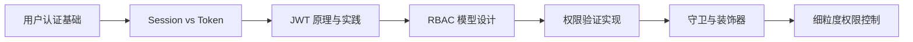
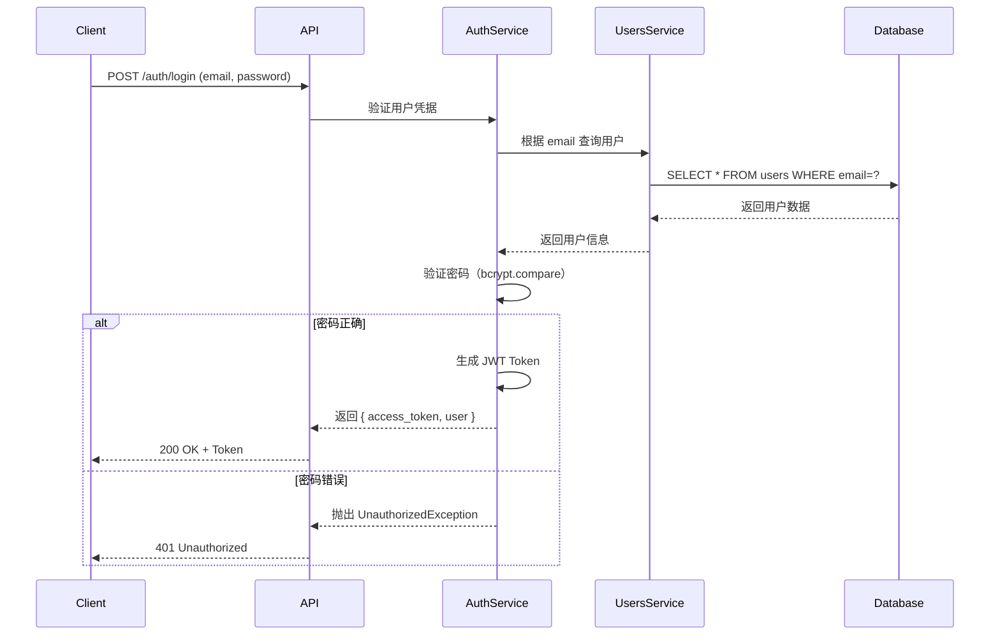
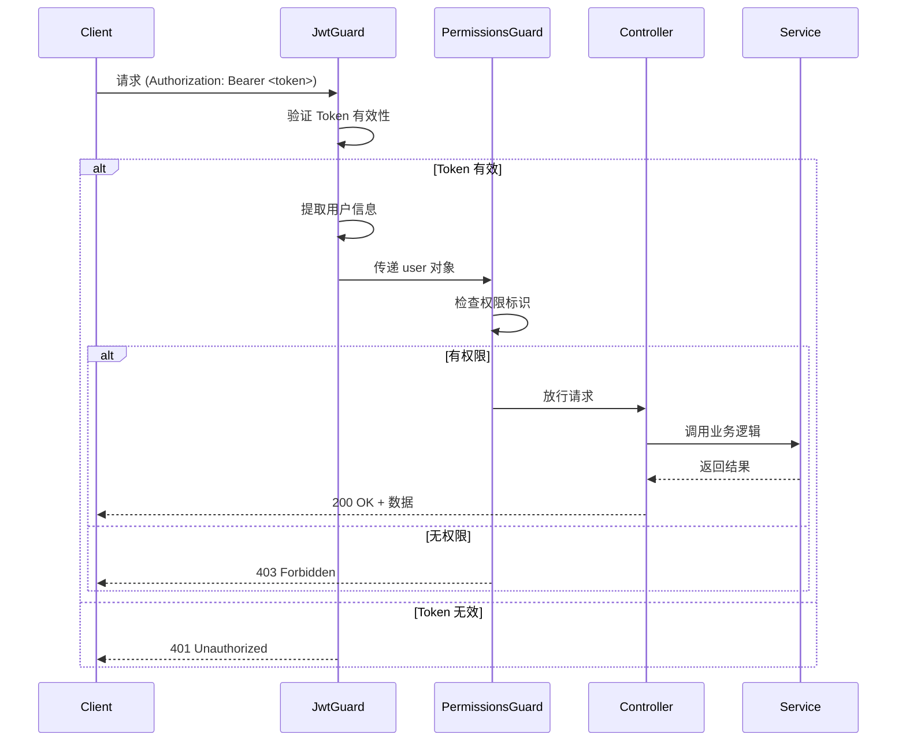
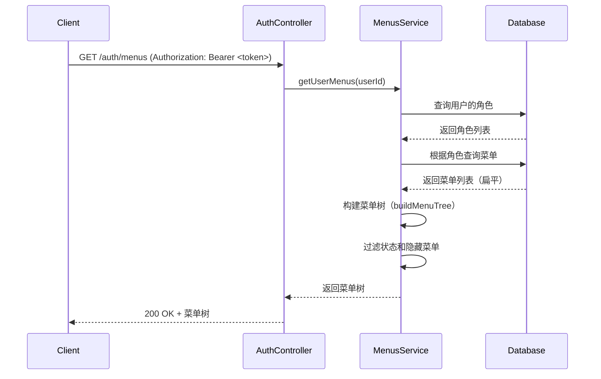
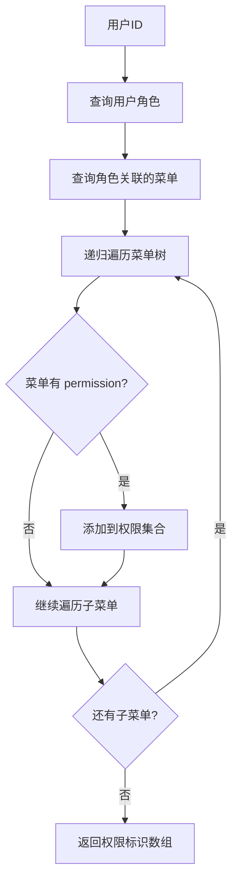

# 系统架构设计

本文档详细介绍 RBAC 权限管理系统的架构设计、数据模型和核心概念。

## 目录

- [RBAC 知识体系](#rbac-知识体系)
- [模块设计](#模块设计)
- [数据库设计](#数据库设计)
- [认证授权流程](#认证授权流程)

---

## RBAC 知识体系

### 什么是 RBAC？

RBAC（Role-Based Access Control）是一种广泛应用的访问控制模型，通过角色来管理用户权限，而不是直接为用户分配权限。

### 核心概念

```
用户 (User) → 角色 (Role) → 菜单 (Menu) / 权限 (Permission) → 资源 (Resource)
```

- **用户 (User)**: 系统的使用者
- **角色 (Role)**: 具有特定职责的身份，如管理员、编辑、访客
- **菜单 (Menu)**: 系统的功能入口，控制前端页面显示和路由访问
- **权限 (Permission)**: 对资源的操作能力，通过菜单的权限标识体现，如 `user:create`、`user:edit`、`user:delete`
- **资源 (Resource)**: 受保护的系统功能或数据，如 API 端点、页面、按钮操作

### 权限模型对比

| 模型 | 说明 | 优势 | 劣势 | 适用场景 |
|------|------|------|------|----------|
| **ACL** (访问控制列表) | 直接为用户分配资源权限 | 简单直观 | 难以维护，扩展性差 | 小型系统、用户少 |
| **RBAC** (角色访问控制) | 通过角色间接授权 | 易于管理，适合中大型系统 | 不支持动态权限 | 企业管理系统 |
| **ABAC** (属性访问控制) | 基于用户/资源属性动态判断 | 灵活强大 | 复杂度高，性能开销大 | 复杂业务场景 |

### 学习路线



**推荐学习步骤：**
1. 理解用户认证的基本流程（注册、登录、会话管理）
2. 掌握 JWT 的工作原理和使用场景
3. 学习 RBAC 的数据模型设计（用户-角色-菜单-权限关系）
4. 实现基于角色的路由守卫
5. 进阶：实现基于权限的细粒度控制
6. 扩展：支持资源所有权验证、数据行级权限

---

## 模块设计

### 整体架构

```
┌─────────────────────────────────────────────────┐
│                   Client Layer                   │
│            (Frontend: Vue/React/etc)             │
└──────────────────┬──────────────────────────────┘
                   │ HTTP/REST API
┌──────────────────▼──────────────────────────────┐
│              API Gateway Layer                   │
│          (Guards, Interceptors, Filters)         │
└──────────────────┬──────────────────────────────┘
                   │
┌──────────────────▼──────────────────────────────┐
│             Controller Layer                     │
│  AuthController │ UsersController │ MenusController │
│  RolesController                                 │
└──────────────────┬──────────────────────────────┘
                   │
┌──────────────────▼──────────────────────────────┐
│              Service Layer                       │
│  AuthService │ UsersService │ MenusService       │
│  RolesService │ PermissionsService               │
└──────────────────┬──────────────────────────────┘
                   │
┌──────────────────▼──────────────────────────────┐
│            Repository Layer                      │
│  TypeORM Repositories (Entity Management)       │
└──────────────────┬──────────────────────────────┘
                   │
┌──────────────────▼──────────────────────────────┐
│             Database Layer                       │
│          MySQL / PostgreSQL                      │
└─────────────────────────────────────────────────┘
```

### 模块结构

```
src/
├── auth/                    # 认证模块
│   ├── guards/             # 守卫（JWT、Role、Permission）
│   │   ├── jwt-auth.guard.ts
│   │   ├── roles.guard.ts
│   │   └── permissions.guard.ts
│   ├── decorators/         # 装饰器（Roles、Permissions、Public）
│   │   ├── roles.decorator.ts
│   │   ├── permissions.decorator.ts
│   │   ├── public.decorator.ts
│   │   └── current-user.decorator.ts
│   ├── strategies/         # Passport 策略
│   │   └── jwt.strategy.ts
│   ├── dto/                # 数据传输对象
│   │   ├── login.dto.ts
│   │   └── register.dto.ts
│   ├── auth.controller.ts  # 认证控制器
│   ├── auth.service.ts     # 认证服务（登录、注册、Token）
│   └── auth.module.ts      # 认证模块
├── users/                   # 用户模块
│   ├── entities/           # 用户实体
│   │   └── user.entity.ts
│   ├── dto/                # DTO
│   │   ├── create-user.dto.ts
│   │   └── update-user.dto.ts
│   ├── users.controller.ts # 用户控制器
│   ├── users.service.ts    # 用户 CRUD
│   └── users.module.ts     # 用户模块
├── menus/                   # 菜单模块 ⭐
│   ├── entities/           # 菜单实体
│   │   └── menu.entity.ts
│   ├── dto/                # DTO（创建、更新菜单）
│   │   ├── create-menu.dto.ts
│   │   └── update-menu.dto.ts
│   ├── enums/              # 枚举（菜单类型、状态）
│   │   ├── menu-type.enum.ts
│   │   └── menu-status.enum.ts
│   ├── menus.controller.ts # 菜单控制器
│   ├── menus.service.ts    # 菜单服务（CRUD、树形查询）
│   └── menus.module.ts     # 菜单模块
├── roles/                   # 角色模块
│   ├── entities/           # 角色实体
│   │   └── role.entity.ts
│   ├── dto/                # DTO（创建角色、分配菜单）
│   │   ├── create-role.dto.ts
│   │   ├── update-role.dto.ts
│   │   └── assign-menus.dto.ts
│   ├── roles.controller.ts # 角色控制器
│   ├── roles.service.ts    # 角色管理、菜单分配
│   └── roles.module.ts     # 角色模块
├── common/                  # 公共模块
│   ├── filters/            # 异常过滤器
│   ├── interceptors/       # 拦截器
│   ├── pipes/              # 管道
│   └── decorators/         # 公共装饰器
├── config/                  # 配置模块
│   ├── database.config.ts  # 数据库配置
│   └── jwt.config.ts       # JWT 配置
├── app.controller.ts        # 应用控制器
├── app.service.ts           # 应用服务
└── app.module.ts            # 根模块
```

### 模块职责说明

#### 1. Auth 模块（认证）
- **职责**：用户登录、注册、JWT Token 签发与验证
- **核心功能**：
  - 用户密码验证（bcrypt）
  - JWT Token 生成与刷新
  - 提供守卫和装饰器供其他模块使用

#### 2. Users 模块（用户管理）
- **职责**：用户 CRUD 操作、用户角色关联
- **核心功能**：
  - 创建、查询、更新、删除用户
  - 为用户分配角色
  - 获取用户的角色和权限信息

#### 3. Menus 模块（菜单管理）⭐
- **职责**：菜单 CRUD、树形结构构建、权限标识提取
- **核心功能**：
  - 支持 5 种菜单类型
  - 构建菜单树形结构
  - 根据用户角色过滤菜单
  - 提取用户权限标识列表

#### 4. Roles 模块（角色管理）
- **职责**：角色 CRUD、角色菜单关联
- **核心功能**：
  - 创建、查询、更新、删除角色
  - 为角色分配菜单
  - 获取角色的菜单树

---

## 数据库设计

### ER 关系图

```
┌──────────┐      ┌──────────────┐      ┌──────────┐
│  users   │◄────►│  user_roles  │◄────►│  roles   │
└──────────┘      └──────────────┘      └──────────┘
                                              │
                                              ▼
                                      ┌──────────────┐
                                      │  role_menus  │
                                      └──────────────┘
                                              │
                                              ▼
                                        ┌──────────┐
                                        │  menus   │
                                        └──────────┘
                                              │
                                              │ self-reference
                                              ▼
                                        (parent_id)
```

### 详细表结构

#### 1. 用户表 (users)

```sql
CREATE TABLE users (
  id INT PRIMARY KEY AUTO_INCREMENT,
  username VARCHAR(50) NOT NULL UNIQUE COMMENT '用户名',
  email VARCHAR(100) NOT NULL UNIQUE COMMENT '邮箱',
  password VARCHAR(255) NOT NULL COMMENT '密码哈希',
  avatar VARCHAR(255) COMMENT '头像URL',
  nickname VARCHAR(50) COMMENT '昵称',
  status TINYINT DEFAULT 1 COMMENT '状态：1-启用，0-禁用',
  last_login_at TIMESTAMP COMMENT '最后登录时间',
  created_at TIMESTAMP DEFAULT CURRENT_TIMESTAMP,
  updated_at TIMESTAMP DEFAULT CURRENT_TIMESTAMP ON UPDATE CURRENT_TIMESTAMP,
  INDEX idx_username (username),
  INDEX idx_email (email),
  INDEX idx_status (status)
);
```

#### 2. 角色表 (roles)

```sql
CREATE TABLE roles (
  id INT PRIMARY KEY AUTO_INCREMENT,
  name VARCHAR(50) NOT NULL COMMENT '角色名称',
  code VARCHAR(50) NOT NULL UNIQUE COMMENT '角色编码（如：admin, editor）',
  description VARCHAR(200) COMMENT '角色描述',
  sort INT DEFAULT 0 COMMENT '排序',
  status TINYINT DEFAULT 1 COMMENT '状态：1-启用，0-禁用',
  created_at TIMESTAMP DEFAULT CURRENT_TIMESTAMP,
  updated_at TIMESTAMP DEFAULT CURRENT_TIMESTAMP ON UPDATE CURRENT_TIMESTAMP,
  INDEX idx_code (code),
  INDEX idx_status (status)
);
```

#### 3. 菜单表 (menus) ⭐

```sql
CREATE TABLE menus (
  id INT PRIMARY KEY AUTO_INCREMENT,
  parent_id INT DEFAULT NULL COMMENT '父菜单ID',
  type VARCHAR(20) NOT NULL COMMENT '菜单类型：directory-目录，menu-菜单，button-按钮，iframe-内嵌，link-外链',
  name VARCHAR(50) NOT NULL UNIQUE COMMENT '菜单名称（唯一标识）',
  title VARCHAR(50) NOT NULL COMMENT '菜单标题',

  -- 路由相关
  path VARCHAR(200) COMMENT '路由地址',
  component VARCHAR(200) COMMENT '页面组件路径',
  redirect VARCHAR(200) COMMENT '重定向地址',

  -- 图标相关
  icon VARCHAR(100) COMMENT '图标',
  active_icon VARCHAR(100) COMMENT '激活图标',
  active_path VARCHAR(200) COMMENT '激活路径',

  -- 链接相关
  iframe_url VARCHAR(500) COMMENT '内嵌页面地址',
  link_url VARCHAR(500) COMMENT '外链地址',

  -- 权限相关
  permission VARCHAR(100) COMMENT '权限标识（如：user:create）',

  -- 徽章相关
  badge_type VARCHAR(20) COMMENT '徽章类型：dot-圆点，text-文本，number-数字',
  badge_content VARCHAR(50) COMMENT '徽章内容',

  -- 配置相关
  sort INT DEFAULT 0 COMMENT '排序',
  status TINYINT DEFAULT 1 COMMENT '状态：1-启用，0-禁用',
  is_hidden TINYINT DEFAULT 0 COMMENT '是否隐藏：1-隐藏，0-显示',
  is_cached TINYINT DEFAULT 0 COMMENT '是否缓存：1-缓存，0-不缓存',
  is_affix TINYINT DEFAULT 0 COMMENT '是否固定在标签栏：1-固定，0-不固定',
  hide_in_breadcrumb TINYINT DEFAULT 0 COMMENT '在面包屑中隐藏：1-隐藏，0-显示',
  hide_children_in_menu TINYINT DEFAULT 0 COMMENT '隐藏子菜单：1-隐藏，0-显示',

  -- 时间戳
  created_at TIMESTAMP DEFAULT CURRENT_TIMESTAMP,
  updated_at TIMESTAMP DEFAULT CURRENT_TIMESTAMP ON UPDATE CURRENT_TIMESTAMP,

  FOREIGN KEY (parent_id) REFERENCES menus(id) ON DELETE CASCADE,
  INDEX idx_parent_id (parent_id),
  INDEX idx_type (type),
  INDEX idx_status (status),
  INDEX idx_sort (sort)
);
```

#### 4. 用户-角色关联表 (user_roles)

```sql
CREATE TABLE user_roles (
  user_id INT NOT NULL,
  role_id INT NOT NULL,
  created_at TIMESTAMP DEFAULT CURRENT_TIMESTAMP,
  PRIMARY KEY (user_id, role_id),
  FOREIGN KEY (user_id) REFERENCES users(id) ON DELETE CASCADE,
  FOREIGN KEY (role_id) REFERENCES roles(id) ON DELETE CASCADE,
  INDEX idx_user_id (user_id),
  INDEX idx_role_id (role_id)
);
```

#### 5. 角色-菜单关联表 (role_menus)

```sql
CREATE TABLE role_menus (
  role_id INT NOT NULL,
  menu_id INT NOT NULL,
  created_at TIMESTAMP DEFAULT CURRENT_TIMESTAMP,
  PRIMARY KEY (role_id, menu_id),
  FOREIGN KEY (role_id) REFERENCES roles(id) ON DELETE CASCADE,
  FOREIGN KEY (menu_id) REFERENCES menus(id) ON DELETE CASCADE,
  INDEX idx_role_id (role_id),
  INDEX idx_menu_id (menu_id)
);
```

### 数据关系说明

1. **用户 ↔ 角色**（多对多）
   - 一个用户可以拥有多个角色
   - 一个角色可以分配给多个用户
   - 通过 `user_roles` 关联表实现

2. **角色 ↔ 菜单**（多对多）
   - 一个角色可以拥有多个菜单
   - 一个菜单可以分配给多个角色
   - 通过 `role_menus` 关联表实现

3. **菜单 ↔ 菜单**（自关联树形结构）
   - 通过 `parent_id` 字段实现父子关系
   - 支持无限层级嵌套
   - `parent_id = NULL` 表示根节点

---

## 认证授权流程

### 1. 用户登录流程



### 2. 请求权限验证流程



### 3. 用户菜单获取流程



### 4. 权限标识提取流程



---

## 技术要点

### 1. JWT 认证策略

```typescript
// jwt.strategy.ts
@Injectable()
export class JwtStrategy extends PassportStrategy(Strategy) {
  constructor(
    private configService: ConfigService,
    private usersService: UsersService,
  ) {
    super({
      jwtFromRequest: ExtractJwt.fromAuthHeaderAsBearerToken(),
      ignoreExpiration: false,
      secretOrKey: configService.get<string>('JWT_SECRET'),
    });
  }

  async validate(payload: any) {
    // payload: { sub: userId, email, iat, exp }
    return await this.usersService.findOne(payload.sub);
  }
}
```

### 2. 递归构建菜单树

```typescript
async buildMenuTree(menus: Menu[], parentId: number = null): Promise<Menu[]> {
  const tree = [];

  for (const menu of menus) {
    if (menu.parentId === parentId) {
      const children = await this.buildMenuTree(menus, menu.id);
      if (children.length > 0) {
        menu.children = children;
      }
      tree.push(menu);
    }
  }

  return tree.sort((a, b) => a.sort - b.sort);
}
```

### 3. 权限验证守卫

```typescript
@Injectable()
export class PermissionsGuard implements CanActivate {
  constructor(private reflector: Reflector) {}

  canActivate(context: ExecutionContext): boolean {
    const requiredPermissions = this.reflector.getAllAndOverride<string[]>(
      PERMISSIONS_KEY,
      [context.getHandler(), context.getClass()],
    );

    if (!requiredPermissions) {
      return true;
    }

    const { user } = context.switchToHttp().getRequest();
    return requiredPermissions.every((permission) =>
      user.permissions?.includes(permission),
    );
  }
}
```

---

## 扩展阅读

- [NestJS Guards 官方文档](https://docs.nestjs.com/guards)
- [TypeORM Relations 官方文档](https://typeorm.io/relations)
- [JWT 最佳实践](https://jwt.io/introduction)
- [RBAC 标准规范（NIST）](https://csrc.nist.gov/projects/role-based-access-control)

---

[返回首页](../README.md) | [下一篇：菜单权限系统](MENU_SYSTEM.md)
